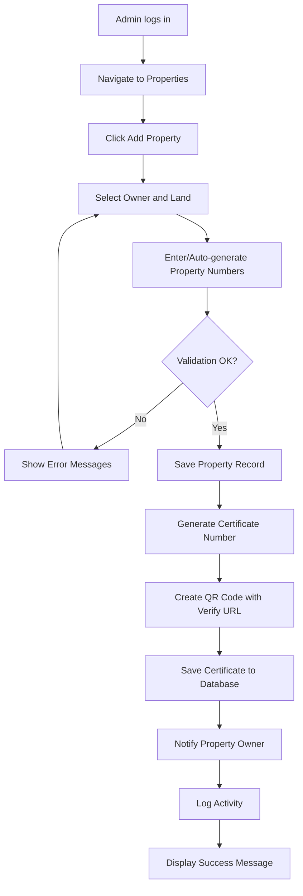
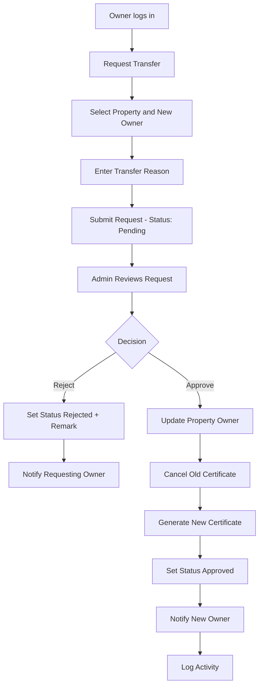
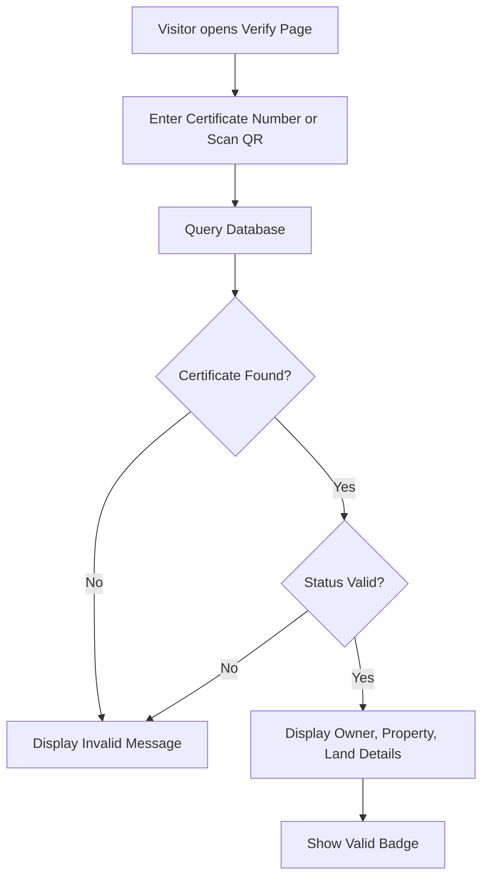
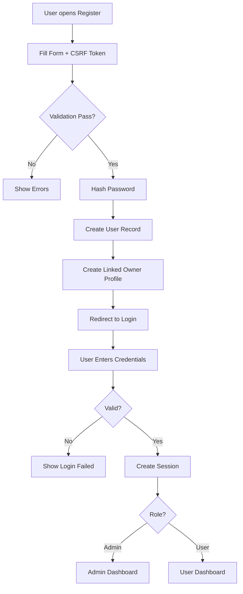

# LandReg Pro - Activity Diagrams

## 1. Property Registration & Certificate Generation

```mermaid
flowchart TD
    A[Admin logs in] --> B[Navigate to Properties]
    B --> C[Click Add Property]
    C --> D[Select Owner and Land]
    D --> E[Enter/Auto-generate Property Numbers]
    E --> F{Validation OK?}
    F -->|No| G[Show Error Messages]
    G --> D
    F -->|Yes| H[Save Property Record]
    H --> I[Generate Certificate Number]
    I --> J[Create QR Code with Verify URL]
    J --> K[Save Certificate to Database]
    K --> L[Notify Property Owner]
    L --> M[Log Activity]
    M --> N[Display Success Message]
```

## 2. Ownership Transfer Process

```mermaid
flowchart TD
    A[Owner logs in] --> B[Request Transfer]
    B --> C[Select Property and New Owner]
    C --> D[Enter Transfer Reason]
    D --> E[Submit Request - Status: Pending]
    E --> F[Admin Reviews Request]
    F --> G{Decision}
    G -->|Reject| H[Set Status Rejected + Remark]
    H --> I[Notify Requesting Owner]
    G -->|Approve| J[Update Property Owner]
    J --> K[Cancel Old Certificate]
    K --> L[Generate New Certificate]
    L --> M[Set Status Approved]
    M --> N[Notify New Owner]
    N --> O[Log Activity]
```

## 3. Certificate Verification

```mermaid
flowchart TD
    A[Visitor opens Verify Page] --> B[Enter Certificate Number or Scan QR]
    B --> C[Query Database]
    C --> D{Certificate Found?}
    D -->|No| E[Display Invalid Message]
    D -->|Yes| F{Status Valid?}
    F -->|No| E
    F -->|Yes| G[Display Owner, Property, Land Details]
    G --> H[Show Valid Badge]
```

## 4. User Registration & Login

```mermaid
flowchart TD
    A[User opens Register] --> B[Fill Form + CSRF Token]
    B --> C{Validation Pass?}
    C -->|No| D[Show Errors]
    C -->|Yes| E[Hash Password]
    E --> F[Create User Record]
    F --> G[Create Linked Owner Profile]
    G --> H[Redirect to Login]
    H --> I[User Enters Credentials]
    I --> J{Valid?}
    J -->|No| K[Show Login Failed]
    J -->|Yes| L[Create Session]
    L --> M{Role?}
    M -->|Admin| N[Admin Dashboard]
    M -->|User| O[User Dashboard]
```
