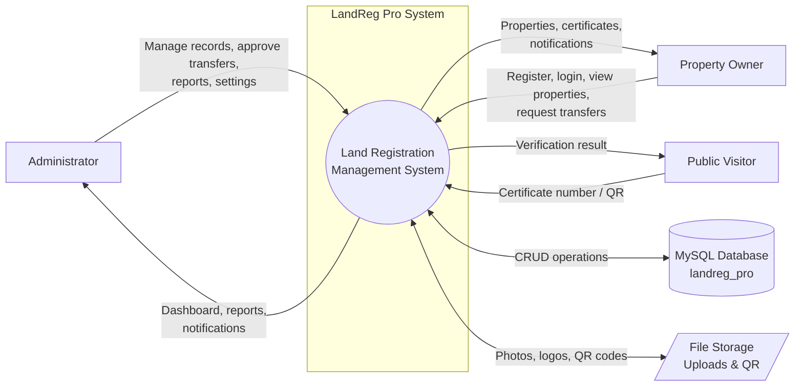
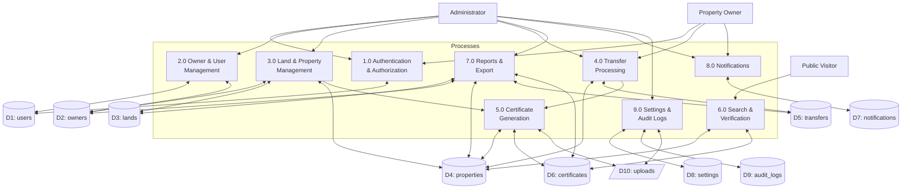

# LandReg Pro - Data Flow Diagrams (DFD)

## DFD Level 0 (Context Diagram)

## DFD Level 1

## Data Store Descriptions

| Store | Contents |
|-------|----------|
| D1: users | Account credentials, roles, profile photos |
| D2: owners | Property owner personal details |
| D3: lands | Land parcel geographic and type data |
| D4: properties | Ownership records linking owners and lands |
| D5: transfers | Transfer requests and approval status |
| D6: certificates | Issued certificates with QR references |
| D7: notifications | User notification messages |
| D8: settings | System and office configuration |
| D9: audit_logs | Activity trail for accountability |
| D10: uploads | Physical files (photos, logos, QR images) |
