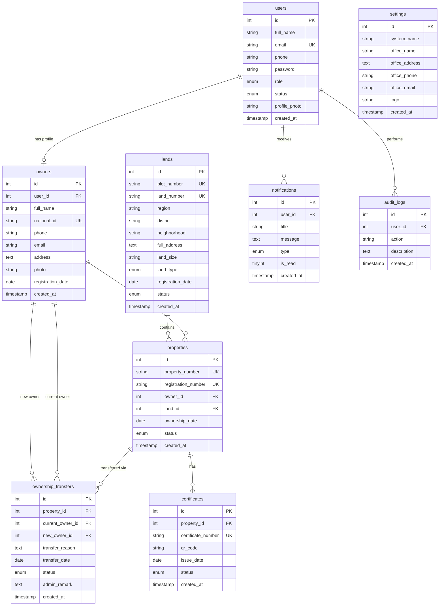

# LandReg Pro - Entity Relationship Diagram (ERD)

## Mermaid ERD

## Relationships Summary

| Relationship | Cardinality | Description |
|-------------|-------------|-------------|
| users → owners | 1:0..1 | A user account may link to one owner profile |
| owners → properties | 1:N | An owner can hold multiple properties |
| lands → properties | 1:N | A land parcel can have property records |
| properties → certificates | 1:N | Each property can have certificate history |
| properties → transfers | 1:N | Transfer requests per property |
