# LandReg Pro - Use Case Diagram

## Actors

1. **Administrator** – Land authority staff with full system access
2. **Property Owner (User)** – Registered citizen managing their properties
3. **Public Visitor** – Unauthenticated user verifying certificates

## Use Case Diagram

```mermaid
flowchart TB
    subgraph Actors
        Admin((Administrator))
        User((Property Owner))
        Public((Public Visitor))
    end

    subgraph Authentication
        UC1[Register Account]
        UC2[Login]
        UC3[Logout]
        UC4[Update Profile]
        UC5[Change Password]
    end

    subgraph AdminManagement
        UC6[Manage Users]
        UC7[Manage Owners]
        UC8[Manage Lands]
        UC9[Manage Properties]
        UC10[Approve/Reject Transfers]
        UC11[Generate Certificates]
        UC12[View Reports]
        UC13[Export PDF/Excel]
        UC14[Send Notifications]
        UC15[Manage Settings]
        UC16[View Audit Logs]
    end

    subgraph UserPortal
        UC17[View Own Properties]
        UC18[View Certificates]
        UC19[Download Certificate]
        UC20[Request Transfer]
        UC21[View Transfer History]
        UC22[Receive Notifications]
    end

    subgraph PublicServices
        UC23[Verify Certificate]
        UC24[Search Records]
    end

    User --> UC1
    User --> UC2
    User --> UC3
    User --> UC4
    User --> UC5
    User --> UC17
    User --> UC18
    User --> UC19
    User --> UC20
    User --> UC21
    User --> UC22
    User --> UC24

    Admin --> UC2
    Admin --> UC3
    Admin --> UC4
    Admin --> UC5
    Admin --> UC6
    Admin --> UC7
    Admin --> UC8
    Admin --> UC9
    Admin --> UC10
    Admin --> UC11
    Admin --> UC12
    Admin --> UC13
    Admin --> UC14
    Admin --> UC15
    Admin --> UC16
    Admin --> UC24

    Public --> UC23

    UC9 -.->|includes| UC11
    UC10 -.->|extends| UC11
```

## Use Case Descriptions

| ID | Use Case | Actor | Description |
|----|----------|-------|-------------|
| UC1 | Register Account | User | Create account with email, password, auto-linked owner profile |
| UC9 | Manage Properties | Admin | CRUD property records; triggers automatic certificate generation |
| UC10 | Approve Transfer | Admin | Updates owner, cancels old certificate, generates new certificate |
| UC11 | Generate Certificate | System/Admin | Auto-created on property registration with QR verification code |
| UC23 | Verify Certificate | Public | Validate certificate by number via QR or web form |
